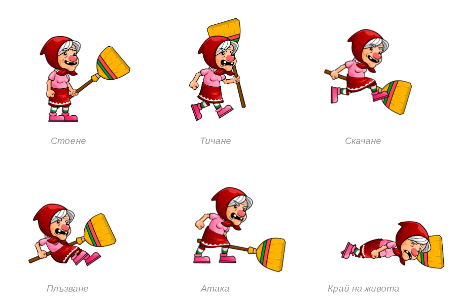
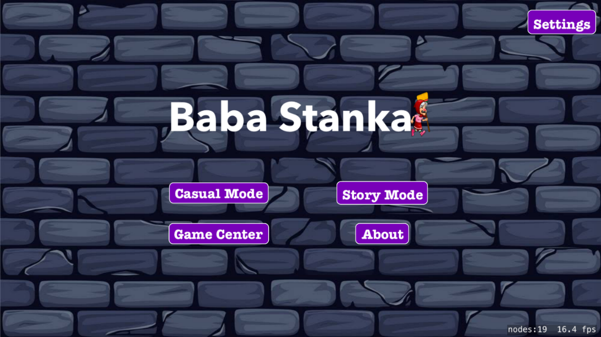

# Въведение

 
2D RPG платформена игра за iOS или Android мобилни устройства,
включваща два режима на игра (неангажиращ режим и режим с история,
в която избраният от потребителя герой ще премине), магазин,
възможност за комуникация между играчите и достъп до Game Center или до Google games.

## В началото бе... меню екранът

В началото пред потребителя ще се зареди главното меню на приложението, съдържащо основните опции за продължаване към различните режими на изпълнение на проекта (съответно достъп до неагажиращия тип игра („casual mode“), режимът, съдържащ история („story mode“), бутон, чието избиране осигурява достъп до услугите на Game Center, бутон, който препраща потребителя към настройките на играта, бутон 
store“, който отваря магазина в приложението, в който потребителят може да сменя облеклото или оръжието на героя, с който играе, бутон за меню „About“, в което може да бъдат прегледани още няколко пъти указанията за игра на всеки от игралните режими, както и да се научи повече информация за идейното създаване на играта и поддържащия я екип).

## Неангажиращ режим

 
В този режим потребителят има за цел да избегне възможно колкото се може повече автоматично
генериращи се препятствия, въз основа, на които се определя неговият краен резултат и със 
завоюваните точки може да се конкурира с останалите играчи, използвайки ранглистите в Game Center,
или да отключва различни значки, чиито стойности може да послужат при отключването на определели 
артикули от магазина в играта. Този режим притежава три степени на трудност. Една игрална сесия 
от този режим започва след натискане на екрана, на който има съобщение, приканващо потребителя да започне. 
След нейното начало, за успешното ѝ преминаване, той трябва да изпълнява определени жестове по екрана, 
чрез които да управлява своя герой, съответно плъзгане надолу, надясно или двойно натискане, 
на които бабата-герой откликва по определен начин, съответно скача над или се плъзга под определени препятстия, 
замахва с "оръжието" си, за да елиминира изпречил ѝ се враг или предмет. Играта няма край, но бабата "умира" в случай,
че потребителят не успее да премине определено препятствие и натрупаните точки от успешно изиграните препятствия се 
начисляват като негов рекорд.

  

## Режим с включена история

 
Този режим представлява платформена игра, в която потребителят притежава пълен контрол над своя герой, за разлика
от първия режим, в който функцията "бягане" се генерира автоматично. Той е разделен на нива, всяко от които съдържа
определена част от цялата история, която бабата ще "преживее". Тук потребителят разполага с бутони за управление на 
своя герой, тип Joystick, и всяка една промяна на координатите му се засича от камера, представяща в близък план 
определена област от екрана. Също така потребителят разполага с набор "сърца" живот, които е възможно да загуби при
падане от височини или в дупки или след неуспешни интеракции след двубой с неприятел. Този режим приключва ако потребителят
"умре" или завърши успешно историята.

<a href="https://drive.google.com/file/d/1SUX4c-Sq_T4VhwO0TAA-GiI2Tk61ZkhM/view?usp=sharing" target="_blank"><b><i> Историята </i></b> (или поне само началото) 
:smile: </a>

<a href="https://drive.google.com/file/d/1GwIbyQAuy-CAIiHmC67v3Mks1SnTVGCa/view?usp=sharing" target="_blank">Клип към играта</a>

## Допълнителни Компоненти

 
Във всеки един от игралните режими, потребителят ще може да събира виртуални монети и след като събере определено количество,
ще може да отключи, предлагащи се във вградения в приложението магазин, костюми или "супер сили", които да прикачи на героя, 
с който играе. В някои случаи някои от предложенията в магазина ще се осъществяват посредством микротранзакции.
В приложението ще бъде налична и социална мрежа, даваща възможност за комуникация между играчите, които от друга страна
ще могат да участват в ранглисти в Game Center, спрямо получените им резултати от неангажиращия режим или от броя отключени
предизвикателства, намиращи се на страницата на играта в Game Center.

  
  
  

